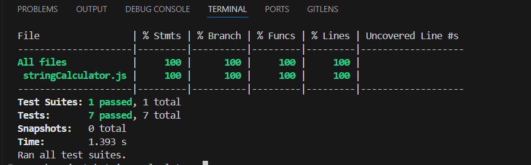

# **String Calculator**

A lightweight JavaScript library that processes strings containing numbers and computes their sum. The calculator supports custom delimiters, newline characters, and includes robust error handling for invalid input cases. This project was developed using **Test-Driven Development (TDD)** principles.

---

## **Features**

- Returns `0` for empty strings.
- Sums numbers separated by commas (`,`) or newlines (`\n`).
- Supports custom delimiters (e.g., `//[delimiter]\n[numbers]`).
- Throws an error for negative numbers and lists them in the error message.

---

## **Installation**

1. Clone the repository:

   ```bash
   git clone https://github.com/Mandar86/string-calculator.git
   cd string-calculator
   ```

2. Install dependencies:
   ```bash
   npm install
   ```

---

## **Usage**

1. Import the `stringCalculator` function:

   ```javascript
   const stringCalculator = require("./stringCalculator");
   ```

2. Use it to compute sums:
   ```javascript
   console.log(stringCalculator("1,2,3")); // Outputs: 6
   console.log(stringCalculator("//;\n1;2")); // Outputs: 3
   ```

---

## **Test Coverage**

This project has comprehensive test coverage to ensure the reliability of all features.

### Coverage Summary

The following is a screenshot of the test coverage report:



---

## **Continuous Integration**

GitHub Actions is set up for this project to automatically run tests on every push and pull request. This ensures that the codebase remains stable and functional.

- **Workflow File:** `.github/workflows/test.yml`
- **Badge:**  
  

---

## **API Reference**

### `stringCalculator(input: string): number`

- **Parameters:**

  - `input` (string): A string containing numbers separated by delimiters.

- **Returns:**

  - The sum of the numbers in the string.

- **Throws:**
  - An error if the input contains negative numbers, with a message listing all negative numbers.

### **Examples**

```javascript
stringCalculator(""); // Returns: 0
stringCalculator("5"); // Returns: 5
stringCalculator("1,2,3"); // Returns: 6
stringCalculator("1\n2,3"); // Returns: 6
stringCalculator("//;\n1;2"); // Returns: 3
stringCalculator("1,-2,3"); // Throws: Error("Negatives not allowed: -2")
```

---

## **Running Tests**

This project uses **Jest** for unit testing.

1. Run all tests:

   ```bash
   npm test
   ```

2. Run a specific test:

   ```bash
   npm test -- stringCalculator.test.js
   ```

3. Check test coverage:
   ```bash
   npx jest --coverage
   ```

---

## **Development**

### **Prerequisites**

- Node.js (v14 or higher)
- npm (v6 or higher)

### **Setup**

1. Fork and clone the repository:

   ```bash
   git clone https://github.com/Mandar86/string-calculator.git
   cd string-calculator
   ```

2. Install dependencies:

   ```bash
   npm install
   ```

3. Make your changes and run tests:

   ```bash
   npm test
   ```

4. Submit a pull request with your changes.

---


## **Contributing**

Contributions are welcome! To contribute:

1. Fork the repository.
2. Create a feature branch:
   ```bash
   git checkout -b feature-name
   ```
3. Commit your changes:
   ```bash
   git commit -m "feat: add new feature"
   ```
4. Push to your branch:
   ```bash
   git push origin feature-name
   ```
5. Open a pull request.

